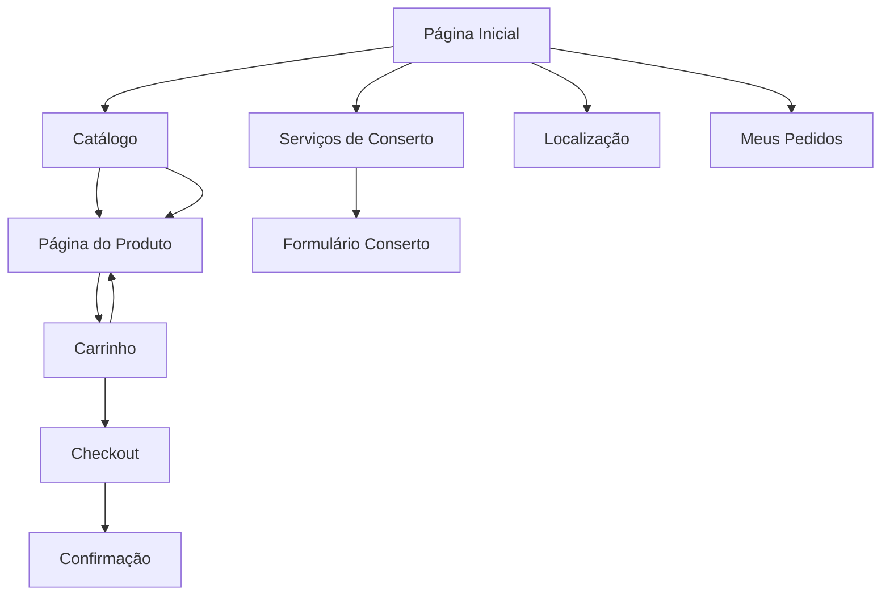

## 1. Visão Geral do Produto

O Bi Games é um e-commerce especializado em jogos eletrônicos que oferece venda online com opção de retirada física, serviços de conserto e suporte via WhatsApp. A plataforma conecta gamers a produtos e serviços com foco na conveniência e experiência local.

**Problema resolvido:** Facilitar a compra de jogos e acessórios com retirada imediata e consertos rápidos, atendendo ao público gamer local que busca agilidade e confiança.

**Público-alvo:** Gamers de todas as idades, pais que compram para filhos, colecionadores e entusiastas de jogos eletrônicos na região.

## 2. Funcionalidades Principais

### 2.1 Papéis de Usuário

| Papel | Método de Cadastro | Permissões Principais |
|-------|-------------------|----------------------|
| Cliente | Cadastro rápido com email ou WhatsApp | Visualizar catálogo, comprar, agendar retirada, solicitar conserto |
| Administrador | Cadastro interno | Gerenciar produtos, pedidos, estoque, serviços de conserto |

### 2.2 Módulos de Funcionalidades

O e-commerce Bi Games consiste nas seguintes páginas principais:

1. **Página Inicial:** Destaques de produtos, banner promocional, categorias, botão WhatsApp flutuante
2. **Catálogo de Produtos:** Lista de jogos e acessórios com filtros por plataforma, preço e categoria
3. **Página do Produto:** Imagens, descrição, preço, botão comprar, especificações técnicas
4. **Carrinho de Compras:** Resumo de itens, quantidade, valor total, cupons de desconto
5. **Checkout:** Formulário de dados, opções de retirada/entrega, pagamento, confirmação
6. **Serviços de Conserto:** Formulário de solicitação, descrição do problema, orçamento
7. **Localização:** Mapa com endereço, horários, informações de contato
8. **Meus Pedidos:** Histórico de compras, status, rastreamento
9. **Suporte WhatsApp:** Integração direta para atendimento

### 2.3 Detalhamento das Páginas

| Nome da Página | Módulo | Descrição das Funcionalidades |
|----------------|---------|------------------------------|
| Página Inicial | Hero Banner | Exibir promoções ativas com carrossel automático de 5 segundos |
| Página Inicial | Categorias | Cards clicáveis para PlayStation, Xbox, Nintendo, PC Gaming, Acessórios |
| Página Inicial | Produtos em Destaque | Grid responsivo com 4-8 produtos mais vendidos |
| Página Inicial | WhatsApp Flutuante | Botão fixo no canto inferior direito com link direto |
| Catálogo | Filtros Laterais | Filtrar por plataforma, faixa de preço, disponibilidade, ordem de preço |
| Catálogo | Grid de Produtos | Cards com imagem, nome, preço, botão adicionar ao carrinho |
| Página do Produto | Galeria de Imagens | Visualização ampliada com miniaturas navegáveis |
| Página do Produto | Informações Principais | Nome, preço, disponibilidade, botão comprar, quantidade |
| Página do Produto | Detalhes Técnicos | Abas com descrição, especificações, requisitos de sistema |
| Carrinho | Lista de Itens | Exibir imagem miniatura, nome, quantidade editável, preço unitário e total |
| Carrinho | Cupom de Desconto | Campo para inserir código promocional com validação |
| Carrinho | Resumo do Pedido | Subtotal, frete/retirada, descontos, total final |
| Checkout | Dados Pessoais | Formulário com nome, email, telefone, CPF para nota fiscal |
| Checkout | Opções de Entrega | Escolher entre retirada na loja (grátis) ou entrega com taxa |
| Checkout | Pagamento | Integração com gateway (Pix, cartão, boleto), ambiente seguro |
| Checkout | Confirmação | Página de sucesso com número do pedido e próximos passos |
| Conserto | Formulário de Solicitação | Tipo de console, descrição do problema, fotos do defeito |
| Conserto | Orçamento | Sistema de aprovação de valor e prazo de conserto |
| Localização | Mapa Interativo | Google Maps com pin da localização exata da loja |
| Localização | Informações de Contato | Endereço completo, horários de funcionamento, telefones |
| Meus Pedidos | Lista de Compras | Cards com data, valor, status, botão de detalhes |
| Meus Pedidos | Rastreamento | Atualização de status: processando, pronto para retirada, finalizado |

## 3. Fluxos Principais

### Fluxo de Compra - Cliente

O cliente acessa a página inicial, navega pelo catálogo, seleciona produtos e adiciona ao carrinho. No checkout, informa dados pessoais, escolhe retirada na loja ou entrega, realiza pagamento e recebe confirmação via WhatsApp com número do pedido.

### Fluxo de Conserto - Cliente

O cliente acessa a página de serviços, preenche formulário com detalhes do console e problema, anexa fotos, envia solicitação. Recebe orçamento via WhatsApp e aprova para dar início ao conserto.

### Fluxo de Gestão - Administrador

O administrador gerencia produtos no catálogo, acompanha pedidos novos, atualiza status de retirada, gerencia solicitações de conserto e mantém estoque atualizado.

## 4. Design da Interface

### 4.1 Estilo Visual

**Opção 1 - Moderno Gamer (RECOMENDADA)**
- Cores primárias: Roxo neon (#8B5CF6) e preto (#000000)
- Cores secundárias: Verde neon (#10B981) e cinza escuro (#1F2937)
- Botões: Estilo 3D com efeitos de profundidade e hover animado
- Tipografia: Fonte futurista (Exo 2) para títulos, Inter para textos
- Layout: Card-based com bordas arredondadas e sombras suaves
- Ícones: Estilo flat design com temática gamer (controles, pixels, neon)

**Opção 2 - Minimalista Clean**
- Cores primárias: Branco (#FFFFFF) e azul escuro (#1E40AF)
- Cores secundárias: Cinza claro (#F3F4F6) e verde (#059669)
- Botões: Rounded corners com gradiente suave
- Tipografia: Poppins para títulos, Roboto para textos
- Layout: Espaçamento generoso, linhas limpas
- Ícones: Estilo outline minimalista

**Opção 3 - Dark Tech**
- Cores primárias: Preto (#0F172A) e laranja neon (#F97316)
- Cores secundárias: Cinza escuro (#374151) e amarelo (#EAB308)
- Botões: Estilo glassmorphism com bordas brilhantes
- Tipografia: Orbitron para títulos, Rajdhani para textos
- Layout: Fundo escuro com elementos em destaque
- Ícones: Estilo neon glow com efeitos de luz

### 4.2 Elementos por Página

| Página | Módulo | Elementos de UI |
|--------|---------|-----------------|
| Inicial | Hero Banner | Carrossel full-width com 3 imagens, altura 400px, botões de navegação |
| Inicial | Categorias | Grid 2x2 mobile, 4x1 desktop, cards com ícones grandes (80px) |
| Catálogo | Filtros | Sidebar colapsável, checkboxes coloridos, slider de preço |
| Produto | Galeria | Main image 500x500px, thumbnails 80x80px, zoom hover effect |
| Carrinho | Cards | Altura 120px, imagem 80x80px, botões + e - circulares |
| Checkout | Formulários | Inputs com bordas arredondadas 8px, labels flutuantes, validação em tempo real |
| Conserto | Upload | Drag-and-drop para fotos, preview em grid 3x3, botão adicionar |

### 4.3 Responsividade

Desktop-first com breakpoints:
- Desktop: 1280px+ (layout completo)
- Tablet: 768px-1279px (sidebar vira accordion)
- Mobile: <768px (menu hambúrguer, cards empilhados)

Touch otimizado com:
- Botões mínimos 44x44px
- Swipe no carrossel
- Touch feedback visual
- Zoom em imagens de produto

### 4.4 Animações e Interações

- Hover effects em cards: scale(1.05) e shadow intensificado
- Loading skeletons enquanto conteúdo carrega
- Transições suaves de página (fade-in)
- Botão WhatsApp: pulse animation a cada 10 segundos
- Carrinho: shake animation ao adicionar item
- Sucesso: confetti animation na confirmação