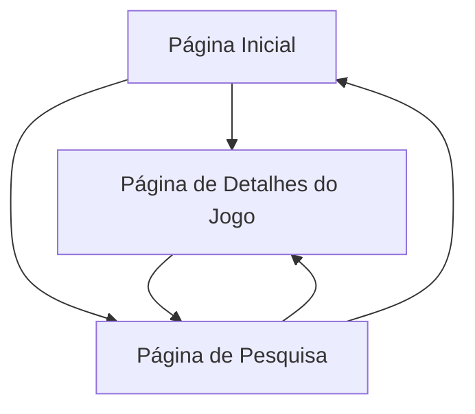

## 1. Visão Geral do Produto
O bigamessite é uma plataforma moderna de descoberta e análise de jogos, projetada para conectar gamers com seus próximos jogos favoritos. A plataforma permite explorar, pesquisar e descobrir jogos com base em preferências pessoais, além de fornecer análises detalhadas e comunidade engajada.

- **Problema**: Dificuldade em descobrir novos jogos relevantes em meio a milhares de lançamentos
- **Público-alvo**: Gamers casuais e hardcore que buscam descobrir e avaliar jogos
- **Valor**: Centraliza descoberta, análises e comunidade em uma interface intuitiva e moderna

## 2. Funcionalidades Principais

### 2.1 Papéis de Usuário
| Papel | Método de Registro | Permissões Principais |
|------|---------------------|------------------|
| Visitante | Sem registro | Navegar, visualizar jogos e análises |
| Usuário Registrado | Email/Social Login | Adicionar análises, favoritos, seguir jogos |
| Moderador | Convite/Upgrade | Gerenciar análises, moderar conteúdo |

### 2.2 Módulos de Funcionalidades
Nossa plataforma de descoberta de jogos consiste nas seguintes páginas principais:

1. **Página Inicial**: Apresentação de jogos em destaque, navegação por categorias, lista de jogos populares e recentes
2. **Página de Detalhes do Jogo**: Informações completas do jogo, análises da comunidade, screenshots e vídeos
3. **Página de Pesquisa**: Filtros avançados por gênero, plataforma, ano, nota, sistema de busca inteligente

### 2.3 Detalhes das Páginas
| Nome da Página | Módulo | Descrição da Funcionalidade |
|-----------|-------------|---------------------|
| Página Inicial | Hero Section | Apresentar jogos em destaque com carrossel automático e banners promocionais |
| Página Inicial | Navegação Categorias | Menu lateral com gêneros de jogos (Ação, RPG, Estratégia, etc.) |
| Página Inicial | Lista de Jogos | Grid responsivo com cards de jogos mostrando capa, título, nota e preço |
| Página Inicial | Filtros Rápidos | Botões para ordenar por popularidade, lançamento, nota e preço |
| Detalhes do Jogo | Galeria de Mídia | Carrossel de screenshots, trailers e gameplay videos |
| Detalhes do Jogo | Informações Técnicas | Tabela com requisitos mínimos, plataformas disponíveis, data de lançamento |
| Detalhes do Jogo | Análises da Comunidade | Lista de análises com notas, texto e sistema de votos úteis |
| Detalhes do Jogo | Ações do Usuário | Botões para favoritar, adicionar à lista, compartilhar e escrever análise |
| Pesquisa | Barra de Busca | Campo de texto com sugestões automáticas e histórico de busca |
| Pesquisa | Filtros Avançados | Painel expansível com múltiplos critérios de filtragem |
| Pesquisa | Resultados | Grid adaptativo com paginação e opções de visualização (grid/lista) |

## 3. Processo Principal
O fluxo principal do usuário começa na página inicial onde pode explorar jogos em destaque e categorias populares. Ao clicar em um jogo, é direcionado para a página de detalhes com informações completas. Através da barra de pesquisa ou navegação por categorias, pode descobrir novos jogos aplicando filtros específicos. Usuários registrados podem adicionar análises e gerenciar sua lista de favoritos.

## 4. Design da Interface

### 4.1 Estilo de Design
- **Cores Primárias**: Preto (#0A0A0A) e cinza escuro (#1A1A1A)
-