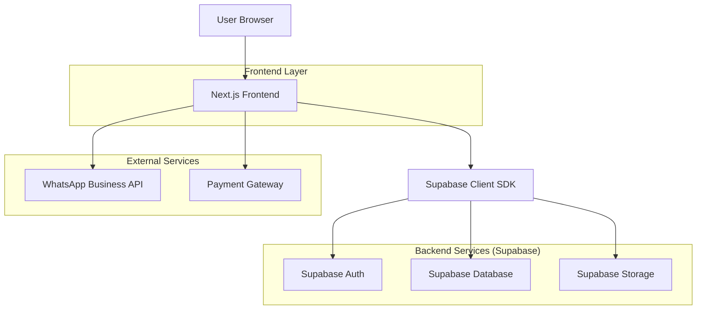
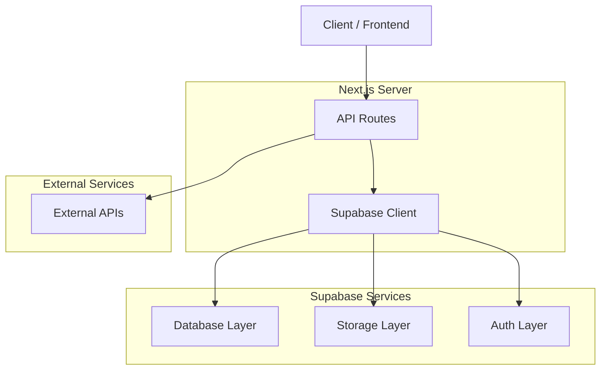
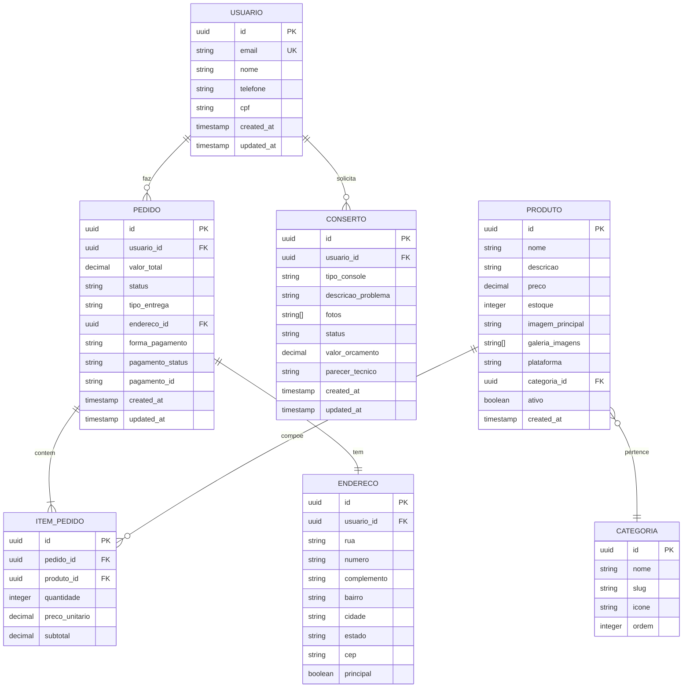

## 1. Arquitetura do Sistema



## 2. Descrição das Tecnologias

- **Frontend:** Next.js 14 + React 18 + TypeScript
- **Estilização:** Tailwind CSS 3 + Framer Motion
- **Inicialização:** create-next-app
- **Backend:** Supabase (BaaS completo)
- **Banco de Dados:** PostgreSQL (via Supabase)
- **Autenticação:** Supabase Auth (com magic links)
- **Storage:** Supabase Storage (imagens de produtos)
- **Pagamento:** API de pagamento (Mercado Pago/PagSeguro)
- **Integração WhatsApp:** WhatsApp Business Cloud API

## 3. Definições de Rotas

| Rota | Propósito |
|------|-----------|
| `/` | Página inicial com destaques e categorias |
| `/catalogo` | Listagem de produtos com filtros |
| `/produto/[id]` | Detalhes do produto individual |
| `/carrinho` | Visualização e gerenciamento do carrinho |
| `/checkout` | Processo de finalização de compra |
| `/pedidos` | Histórico de pedidos do usuário |
| `/conserto` | Solicitação de serviços de conserto |
| `/localizacao` | Informações de localização e contato |
| `/api/webhook/pagamento` | Webhook para confirmação de pagamento |
| `/api/webhook/whatsapp` | Webhook para mensagens do WhatsApp |

## 4. Definições de API

### 4.1 API de Produtos

**Listar produtos**
```
GET /api/produtos
```

Query Parameters:
| Parâmetro | Tipo | Obrigatório | Descrição |
|-----------|------|-------------|-----------|
| categoria | string | false | Filtrar por categoria |
| plataforma | string | false | Filtrar por plataforma |
| preco_min | number | false | Preço mínimo |
| preco_max | number | false | Preço máximo |
| ordenar | string | false | 'preco_asc', 'preco_desc', 'nome' |

**Buscar produto por ID**
```
GET /api/produtos/[id]
```

### 4.2 API de Pedidos

**Criar pedido**
```
POST /api/pedidos
```

Request Body:
```json
{
  "items": [
    {
      "produto_id": "uuid",
      "quantidade": 1,
      "preco_unitario": 299.90
    }
  ],
  "tipo_entrega": "retirada" | "entrega",
  "endereco_entrega": {
    "rua": "string",
    "numero": "string",
    "bairro": "string",
    "cidade": "string",
    "cep": "string"
  },
  "forma_pagamento": "pix" | "cartao" | "boleto"
}
```

### 4.3 API de Conserto

**Solicitar conserto**
```
POST /api/consertos
```

Request Body:
```json
{
  "tipo_console": "PlayStation 5" | "Xbox Series" | "Nintendo Switch" | "PlayStation 4" | "Xbox One",
  "descricao_problema": "string",
  "fotos": ["url1", "url2"],
  "nome_cliente": "string",
  "telefone": "string",
  "email": "string"
}
```

## 5. Arquitetura do Servidor



## 6. Modelo de Dados

### 6.1 Diagrama de Entidades



### 6.2 Definições SQL

**Tabela de Usuários (usuarios)**
```sql
CREATE TABLE usuarios (
  id UUID PRIMARY KEY DEFAULT gen_random_uuid(),
  email VARCHAR(255) UNIQUE NOT NULL,
  nome VARCHAR(255) NOT NULL,
  telefone VARCHAR(20) NOT NULL,
  cpf VARCHAR(14),
  created_at TIMESTAMP WITH TIME ZONE DEFAULT NOW(),
  updated_at TIMESTAMP WITH TIME ZONE DEFAULT NOW()
);

-- Índices para performance
CREATE INDEX idx_usuarios_email ON usuarios(email);
CREATE INDEX idx_usuarios_telefone ON usuarios(telefone);
```

**Tabela de Produtos (produtos)**
```sql
CREATE TABLE produtos (
  id UUID PRIMARY KEY DEFAULT gen_random_uuid(),
  nome VARCHAR(255) NOT NULL,
  descricao TEXT,
  preco DECIMAL(10,2) NOT NULL,
  estoque INTEGER DEFAULT 0,
  imagem_principal VARCHAR(500),
  galeria_imagens TEXT[], -- Array de URLs
  plataforma VARCHAR(50) NOT NULL,
  categoria_id UUID REFERENCES categorias(id),
  ativo BOOLEAN DEFAULT true,
  created_at TIMESTAMP WITH TIME ZONE DEFAULT NOW(),
  updated_at TIMESTAMP WITH TIME ZONE DEFAULT NOW()
);

CREATE INDEX idx_produtos_categoria ON produtos(categoria_id);
CREATE INDEX idx_produtos_ativo ON produtos(ativo);
CREATE INDEX idx_produtos_preco ON produtos(preco);
```

**Tabela de Categorias (categorias)**
```sql
CREATE TABLE categorias (
  id UUID PRIMARY KEY DEFAULT gen_random_uuid(),
  nome VARCHAR(100) NOT NULL,
  slug VARCHAR(100) UNIQUE NOT NULL,
  icone VARCHAR(50),
  ordem INTEGER DEFAULT 0,
  created_at TIMESTAMP WITH TIME ZONE DEFAULT NOW()
);

-- Dados iniciais
INSERT INTO categorias (nome, slug, icone, ordem) VALUES
('Jogos PlayStation', 'jogos-ps', 'gamepad', 1),
('Jogos Xbox', 'jogos-xbox', 'xbox', 2),
('Jogos Nintendo', 'jogos-nintendo', 'nintendo-switch', 3),
('Acessórios', 'acessorios', 'headphones', 4),
('Consoles', 'consoles', 'desktop', 5);
```

**Tabela de Pedidos (pedidos)**
```sql
CREATE TABLE pedidos (
  id UUID PRIMARY KEY DEFAULT gen_random_uuid(),
  usuario_id UUID REFERENCES usuarios(id) NOT NULL,
  valor_total DECIMAL(10,2) NOT NULL,
  status VARCHAR(50) DEFAULT 'processando',
  tipo_entrega VARCHAR(20) NOT NULL,
  endereco_id UUID REFERENCES enderecos(id),
  forma_pagamento VARCHAR(20) NOT NULL,
  pagamento_status VARCHAR(50) DEFAULT 'pendente',
  pagamento_id VARCHAR(100),
  created_at TIMESTAMP WITH TIME ZONE DEFAULT NOW(),
  updated_at TIMESTAMP WITH TIME ZONE DEFAULT NOW()
);

CREATE INDEX idx_pedidos_usuario ON pedidos(usuario_id);
CREATE INDEX idx_pedidos_status ON pedidos(status);
CREATE INDEX idx_pedidos_created ON pedidos(created_at DESC);
```

**Permissões Supabase**
```sql
-- Permissões básicas para usuários anônimos
GRANT SELECT ON categorias TO anon;
GRANT SELECT ON produtos TO anon;

-- Permissões completas para usuários autenticados
GRANT ALL PRIVILEGES ON usuarios TO authenticated;
GRANT ALL PRIVILEGES ON pedidos TO authenticated;
GRANT ALL PRIVILEGES ON itens_pedido TO authenticated;
GRANT ALL PRIVILEGES ON consertos TO authenticated;
GRANT ALL PRIVILEGES ON enderecos TO authenticated;

-- Políticas de segurança RLS
ALTER TABLE usuarios ENABLE ROW LEVEL SECURITY;
ALTER TABLE pedidos ENABLE ROW LEVEL SECURITY;
ALTER TABLE consertos ENABLE ROW LEVEL SECURITY;
ALTER TABLE enderecos ENABLE ROW LEVEL SECURITY;

-- Política: usuários só podem ver seus próprios dados
CREATE POLICY "usuarios_ver_proprio" ON usuarios
  FOR SELECT USING (auth.uid() = id);

CREATE POLICY "pedidos_ver_proprio" ON pedidos
  FOR SELECT USING (auth.uid() = usuario_id);

CREATE POLICY "consertos_ver_proprio" ON consertos
  FOR SELECT USING (auth.uid() = usuario_id);
```

## 7. Configurações de Deploy

### 7.1 Variáveis de Ambiente

```bash
# Supabase
NEXT_PUBLIC_SUPABASE_URL=your-project-url
NEXT_PUBLIC_SUPABASE_ANON_KEY=your-anon-key
SUPABASE_SERVICE_ROLE_KEY=your-service-role-key

# Pagamento (exemplo com Mercado Pago)
MERCADO_PAGO_ACCESS_TOKEN=your-access-token
MERCADO_PAGO_PUBLIC_KEY=your-public-key

# WhatsApp Business API
WHATSAPP_ACCESS_TOKEN=your-whatsapp-token
WHATSAPP_PHONE_NUMBER_ID=your-phone-number-id
WHATSAPP_BUSINESS_ACCOUNT_ID=your-business-account-id

# Google Maps
NEXT_PUBLIC_GOOGLE_MAPS_API_KEY=your-maps-key
```

### 7.2 Comandos de Build

```json
{
  "scripts": {
    "dev": "next dev",
    "build": "next build",
    "start": "next start",
    "lint": "next lint"
  }
}
```